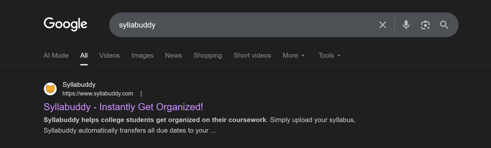
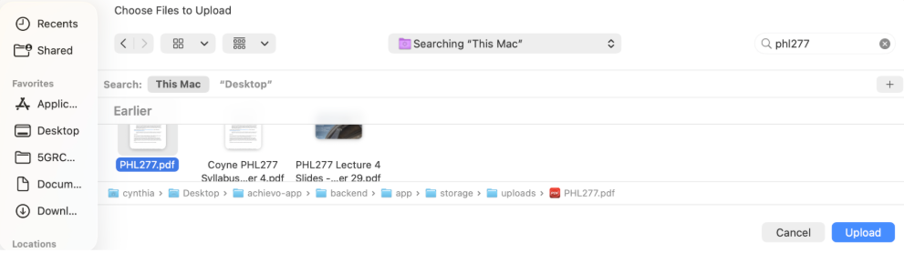
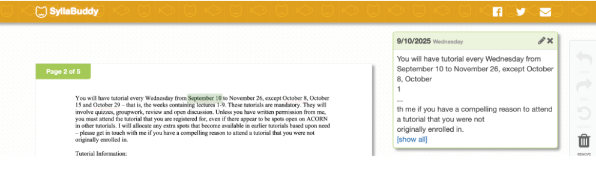
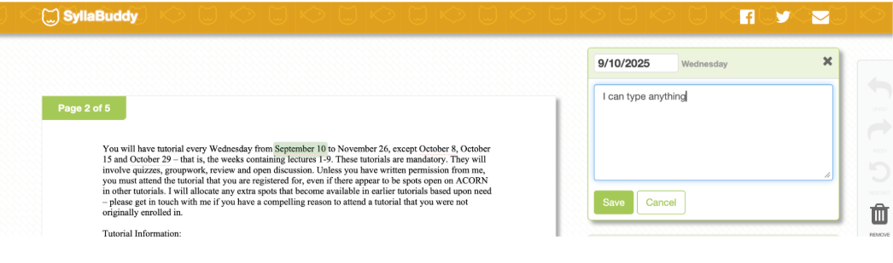
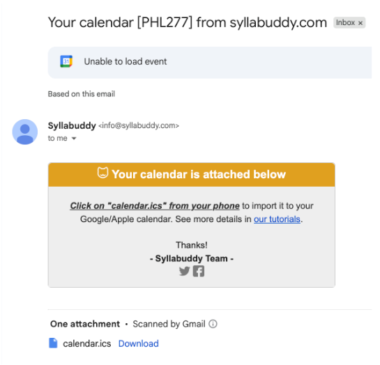
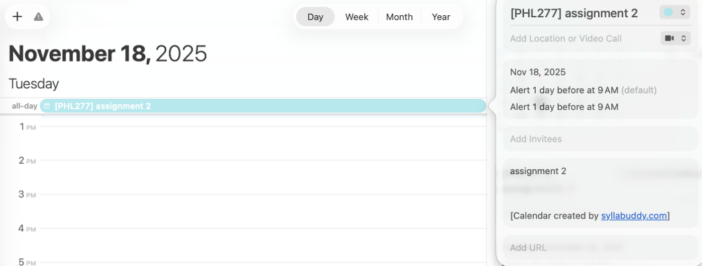

# Assignment 7 – Competitive CUJ  

## Group and Submission Details
**Team Name**: Team Achievo 

**Team Members**:
- Hongzip Kim - 1007637826 
- Anushka Sharma - 1008060704 
- Zoey Xie - 1009001465
- Cynthia Zhou - 1009028918
- Kathy Lee (CSC454 only) - 1007276314

**Submission Date:** 2025-11-08

## TL;DR (Max 65 words)  
We tested **Syllabuddy**, a web app that extracts assignment deadlines from uploaded syllabi. While it offers quick access to course timelines, its extraction accuracy is low and requires heavy manual correction. **Achievo** improves this process with smarter AI parsing, instant cloud saving, and gamified motivation—making coursework management faster, more reliable, and engaging.  

## User Goal Statement  
As a student, I want to know when my assignments and tests are for my courses so that I can better manage my time and stay organized throughout the semester. *(Scheduling JTBD)*  

## Summary of Findings  

<table>
<tr>
<td width="150">
  
</td>
<td>

**User Persona:** Paul Paw  
**Program:** 4th-year undergraduate student, Computer Science  
**Experience Level:** Intermediate tech user; familiar with productivity apps but new to Syllabuddy  
**Context:** At the start of a new semester, Paul wants to extract deadlines from multiple course syllabi to plan workload across weeks.  

**Tools Used:**  
- **Primary Tool:** Syllabuddy (web app)  
- **Secondary Tools:** Google Chrome, Local File Explorer, Gmail, Google Calendar 

</td>
</tr>
</table>

Putting ourselves in the shoes of our persona, Paul, we found that Syllabuddy performs its main function of extracting deadlines from syllabi relatively quickly. However, its accuracy was poor, requiring significant manual correction for nearly every task. This undermines its purpose of saving time and reducing cognitive load.  

One highlight is the clean and intuitive interface, which makes navigation simple even for new users. The side-by-side view of syllabus text and extracted tasks is particularly effective for verification. However, the constant need to correct errors and switch between tools (browser → email → calendar) makes the process inefficient.  

While Syllabuddy speeds up initial extraction, it shifts effort to manual editing later. The key takeaway is that automation must balance speed with precision. Achievo aims to address these gaps by implementing contextual AI/NLP parsing, direct calendar sync, and motivational design.  

### Highlights and Lowlights Table

| Task | Severity | Notes |
|:---|:---|:---|
| Search for Syllabuddy & upload syllabus | Moderate | Straightforward, but requires browsing through local files |
| View extracted tasks side-by-side | Great | Clear layout, easy to validate results |
| Manually edit, delete, or add tasks | Severe | Heavy manual correction; no auto-time extraction |
| Email tasks to yourself | Great | Simple and intuitive |
| Import exported tasks into calendar | Moderate | Manual download/import adds friction |

## Product Recommendations  

- Improve text parsing using NLP models that understand academic context (e.g., distinguishing lectures vs. deadlines).  
- Add file memory or user accounts for saved uploads and batch processing.  
- Enable **direct calendar export** (Google/Outlook integration) instead of requiring email.  
- Provide **task categorization** (assignment, quiz, lab) to improve clarity and overview.  
  
Overall, while Syllabuddy achieves its goal of converting syllabi into timelines, its extraction errors and manual workflows make it inefficient. The experience highlights the importance of reducing tool-switching and improving contextual AI parsing—principles we carry forward into Achievo’s design.  

## Competitor Product Analysis and Comparison  

### Strengths (Competitor)
Syllabuddy excels in simplicity and accessibility. It’s easy to find online, has a clean interface, and performs its core function of extracting dates within minutes. The side-by-side comparison helps users quickly verify extracted data.  

### Weaknesses (Competitor)
Its main weakness lies in accuracy and efficiency. The parser appears to pull every date in the syllabus indiscriminately, leading to incomplete or incorrect tasks. Nearly all entries required manual fixes, defeating automation’s purpose. The reliance on emailed `.ics` files also introduces multiple context switches and extra steps.  

### Comparison with Our Product (Achievo)
Achievo significantly improves on Syllabuddy’s weaknesses through four key differentiators:

- **AI Extraction:** Our model parses syllabi contextually, distinguishing between lecture dates, due dates, and exams for precise task generation.
- **Automatic Workflow:** Tasks are instantly saved to the cloud and synced with the user’s dashboard—no email or manual import required.
- **Motivational Design:** Achievo introduces gamification (coin rewards, blind boxes, confetti animations) to boost student engagement and consistency.
- **Cross-Platform Integration:** As a Chrome extension connected to Canvas and the broader web, Achievo functions seamlessly in the student’s existing workflow.

It’s good to note that Syllabuddy offers a side-by-side view to show where each task is extracted, but we don’t include this in Achievo. As a Chrome extension, we have a limited sidebar view. Hence, we prioritize a clean, focused task display for a faster and simpler user experience.

In essence, while Syllabuddy is a functional prototype for syllabus parsing, Achievo redefines the process with automation, accuracy, and motivation at its core.
 
## CUJ Overview  

| Task | Time | Switches |
|:---|:---|:---|
| Search for Syllabuddy & upload syllabus | 1 min | 3 |
| View extracted tasks side-by-side | 3 min | 1 |
| Manually edit, delete, or add tasks | 5 min | 1 |
| Email tasks to yourself | 1 min | 2 |
| Import exported tasks into calendar | 3 min | 2 |

**Total Time:** 13 minutes  
**Total Switches:** 9  

## Task Summary  

The user’s journey on Syllabuddy involves nine main steps, beginning with discovering the platform and uploading a syllabus. While the workflow is simple, it’s slowed by manual corrections and frequent app switching. Most time is spent fixing inaccuracies and manually importing the final `.ics` file.  Overall, the process achieves its functional goal but lacks automation and precision, which are gaps Achievo directly addresses.  

## Detailed CUJ  

| Step | Notes (What + Why) | Screenshot |
|:--:|:--|:--|
| **1** | **What:** Google “Syllabuddy” and navigate to the official website. **Why:** This is how the user first discovers and accesses the platform. The search step establishes entry to the workflow, highlighting that Syllabuddy is easy to find online. |  |
| **2** | **What:** Click the “Upload Now” button. **Why:** This begins the main task extraction flow. The button acts as a clear call-to-action, signaling the start of interaction with the product. |  |
| **3** | **What:** Select the local syllabus file and upload it to the platform. **Why:** Uploading triggers the backend text-parsing engine. The user must locate and select their syllabus file, which may take time depending on file organization. |  |
| **4** | **What:** View the extracted task list displayed side by side with the syllabus. **Why:** This dual-view layout helps verify extraction accuracy by allowing users to compare original text and parsed output directly. It’s intuitive but exposes the limitations of the parsing algorithm. |  |
| **5** | **What:** Manually edit, delete, or add tasks to correct missed or misinterpreted items. **Why:** Ensures the final task list matches the syllabus and prevents missed deadlines. This step felt tedious, as nearly every date required manual correction, reducing trust in automation. |  |
| **6** | **What:** Enter the course name and email address, then click “Send Calendar.” **Why:** Enables portability by letting users send task lists to themselves. It’s straightforward but adds another manual step that could be automated. |  |
| **7** | **What:** Receive an on-screen confirmation that the email was sent successfully. **Why:** Provides reassurance that the export worked, giving closure to the email-sending step. However, the user must still leave the site to complete the process. |  |
| **8** | **What:** Open the inbox and find the email from Syllabuddy containing the `.ics` calendar export. **Why:** Confirms successful transmission of the task data and initiates the next context switch: from web to email, introducing slight friction. |  |
| **9** | **What:** Download and import the `.ics` file into a personal calendar app (e.g., Google Calendar or Outlook). **Why:** Completes the end-to-end workflow by integrating the extracted tasks into the user’s daily schedule. While functional, it highlights how many manual steps are needed to reach a simple goal. |  |

