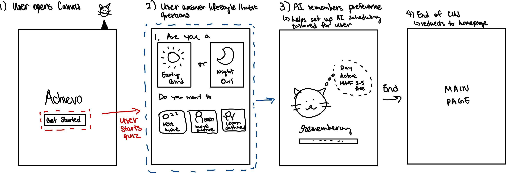
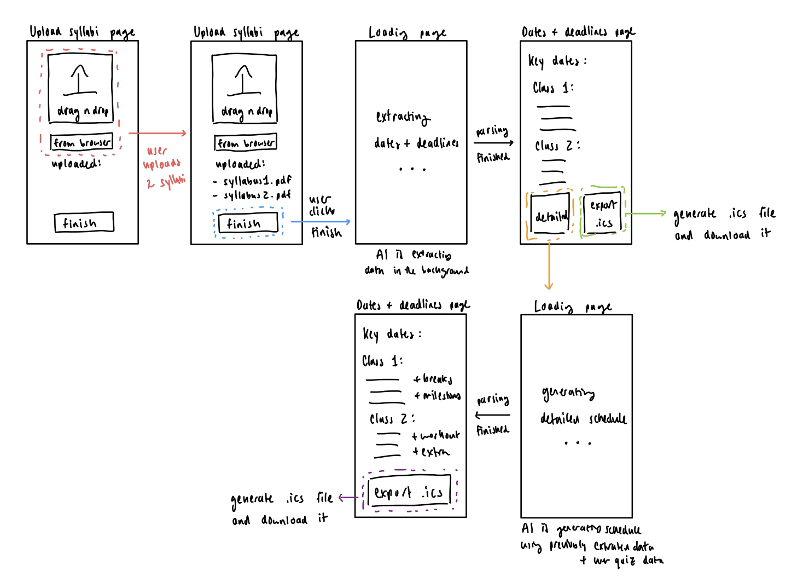
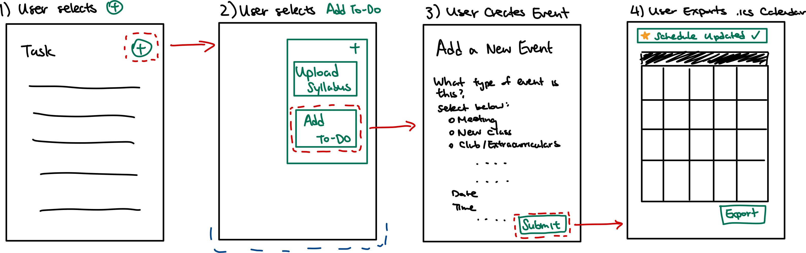
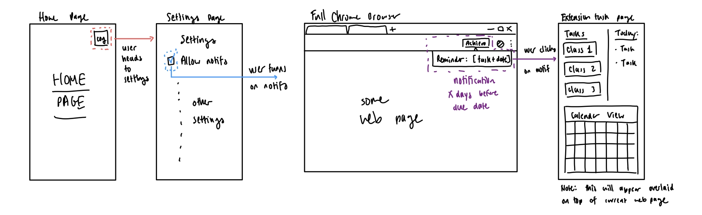

# Use Cases

## Jobs To Be Done (JTBD)

As part of our product use cases, we have the following 3 JTBDs:

### 1. Scheduling
As a student, I want to be able to organize all my to-dos in one place (including tests, assignments, and personal commitments) so that I can easily manage my schedule and stay on top of upcoming deadlines.

### 2. Notifications
As a student, I want to be reminded of my tasks and deadlines so that I can make sure I have them completed.

### 3. Gamification
As a student, I want to receive an incentive, or reward for completing my tasks so that I can have the motivation to continue and be encouraged to continue keeping up with my tasks. 

## Critical User Journeys (CUJs)

For the scope of our MVP, we have identified the following 6 CUJs, listed in sequential order of user journey.

### 1. Onboarding Quiz
**Description**: The user will complete a short onboarding quiz about their work-study habits and goals. Their responses will help the AI create a more personalized and effective schedule for them.

**JTBD**: Scheduling

**User Path**:
   1. User will Open chrome extension
   2. Sign up for account/link with Canvas for their account
   3. Quiz will be prompted if they are first time user
   4. Answer multiple choice questions like:
      - Do you prefer studying in the morning/night?
      - What are times you cannot do?
      - Let user block out class time, commute, meeting timeslots 
      - What are your goals for mental health?
   5. Once completed, the AI will better understand their preference, and understand better about the user.  

**UI/UX Mock-Up**:  

### 2. Schedule Generation
**Description**: The user uploads their syllabi, and the AI generates a schedule with both high-level and detailed task breakdowns. Users can export these as calendar files for easier integration into their workflow.  

**JTBD**: Scheduling

**User Path**:  
1. User uploads syllabi as a PDF file.  
2. AI extracts all relevant data and displays the schedule on the UI.  
3. User can export the schedule as an `.ics` file.  
4. User clicks a button to generate more detailed task breakdowns, such as:  
   - When to start working on an assignment  
   - Reminders to work out  
   - Breaks  
5. AI generates the detailed task breakdown and displays it on the UI.  
6. User can export the detailed breakdown as an `.ics` file.  

**UI/UX Mock-Up**:  

  

### 3. Schedule Adjustment
**Description**: The user may have changes to their schedule that are not included in their syllabi. They can manually add events, and the AI will update the calendar accordingly, including shifting deadlines if needed.  

**JTBD**: Scheduling

**User Path**:  
1. User opens the Chrome extension and clicks on the **“Add” (+)** button.  
2. A pop-up appears asking the user to choose between:  
   - Uploading a syllabus  
   - Adding a new "to-do"
3. User selects **Add To-Do** to better describe their situation.  
4. User is brought to a separate page to manually add a new event to their calendar.  
5. User submits the desired change.  
6. AI updates the schedule accordingly, shifting deadlines if necessary.  
7. User is returned to the updated calendar view.  
8. User can export the updated calendar as an `.ics` file.  

**UI/UX Mock-Up**:  

  

### 4. Task Notifications
**Description**: The user can receive notifications for upcoming deadlines and tasks. Clicking on a notification will bring them to their task list, where they can update progress and earn rewards.  

**JTBD**: Notifications & Keeping Track of Deadlines  

**User Path**:  
1. User navigates to the **Settings** tab.  
2. User clicks **“Allow Notifications”** in settings.  
3. User begins receiving notifications for deadlines and break reminders.  
4. User clicks a notification → views tasks, updates progress, and earns rewards.  

**UI/UX Mock-Up**:  

  

### 5. Task Completion & Rewards
**Description**: The user can mark tasks as complete either through Canvas or directly in the extension. Upon completion, they are rewarded with animations and in-game currency.  

**JTBD**: Gamification  

**User Path**:  
1. User completes a task by either:  
   - Clicking **“Complete”** in the extension  
   - Submitting it on Canvas  
2. User receives a reward animation.  
3. User sees in-game currency added to their balance.  

**UI/UX Mock-Up**:  

  

### 6. Rewards Redemption
**Description**: The user can spend their earned in-game currency to unlock prizes. Unlocked prizes are added to their collection.  

**JTBD**: Gamification  

**User Path**:  
1. User opens the **Rewards Page**.  
2. User checks their collected prizes.  
3. User navigates to the **Store**.  
4. User spends in-game currency to unlock a prize.  
5. User is redirected back to the **Collection**, where the new prize is added.  

**UI/UX Mock-Up**:  

  

## Functional Requirements  

1. The user uploads the syllabus.  
2. The user answers a series of questions tailored to their study habits, goals, mental health breaks, and “hard no-s” (e.g., club meeting from 7–10pm on Tuesdays, commute 9-10am daily).  
3. The user can see their schedule (based on AI tailored output).  
   - Calendar `.ics` file export  
   - In-built task/breakdown calendar view of each task per course  
   - Milestones (micro-deadlines)  
4. The app allows users to adjust their schedule via settings.  
   - e.g., when an assignment due date changes  
5. Notifications are prompted to the user whenever a milestone/deadline is coming up.  
6. UI pop-up of progress bar whenever part of a milestone is achieved and/or it’s time for breaks.  
7. The app encourages the user to take breaks, especially when deadlines are further away.  
8. The app recommends personalized break activities based on the onboarding quiz (e.g., go to the gym, get a snack, etc.).  
9. Automatic sync with Canvas:  
   - When an assignment is submitted, a pop-up UI congratulates the user and marks the relevant task as completed.  
10. The app allows users to open blind boxes.  
11. Users can purchase blind boxes with in-game currency.  

## Non-Functional Requirements  

1. User-friendly interface that requires little to no onboarding.  
2. Visually appealing blind boxes & prizes to better incentivize students to complete tasks.  
3. Seamless integration with Canvas that requires no manual syncing.  
4. Secure storage of personal data.  

