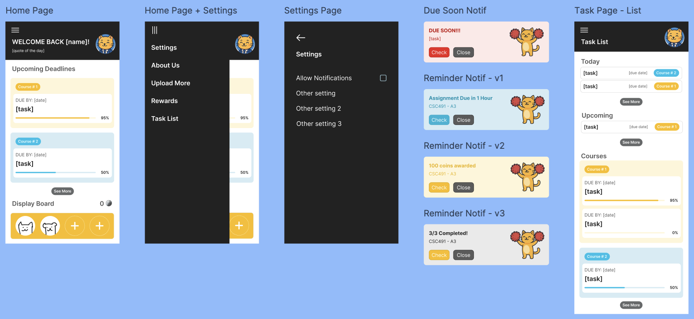
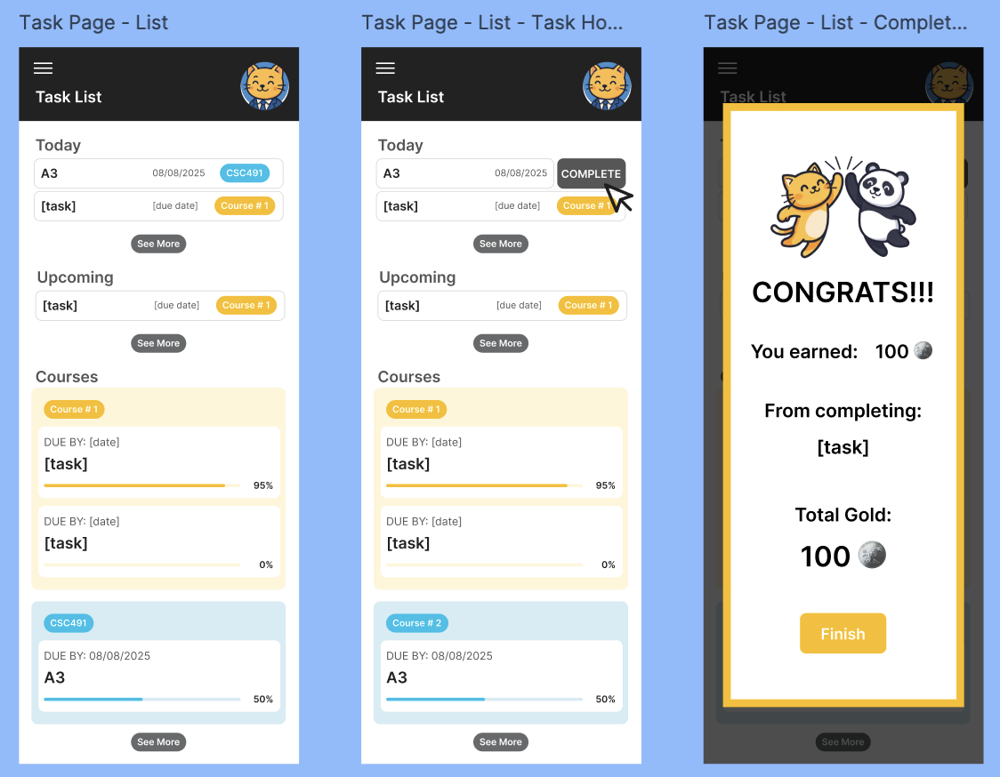
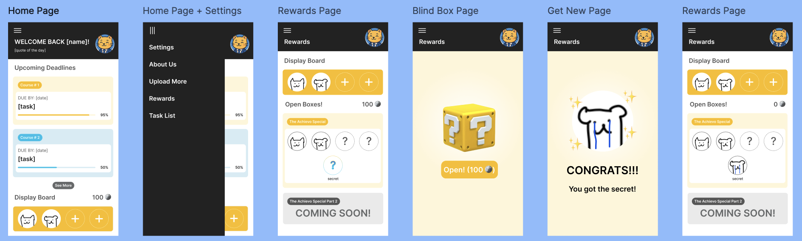
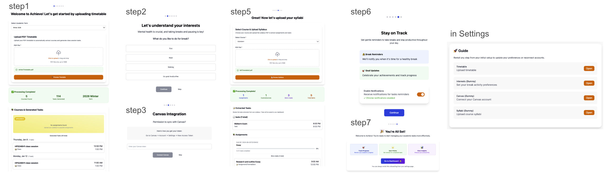
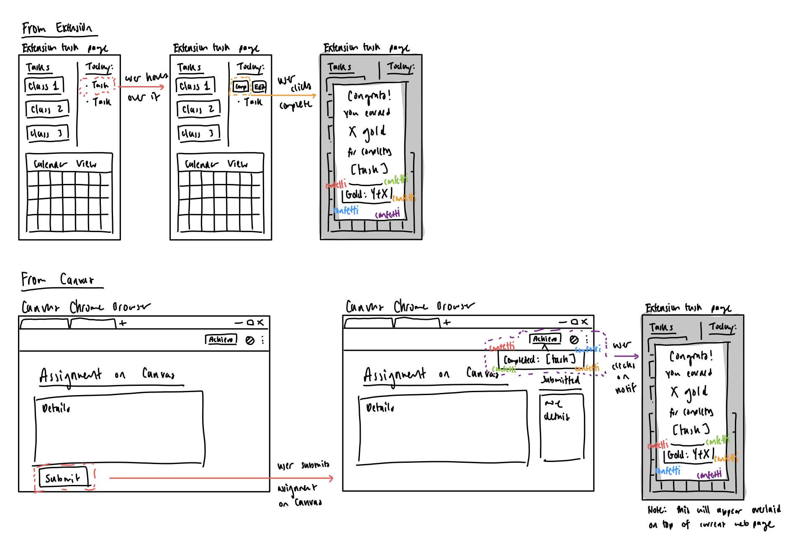
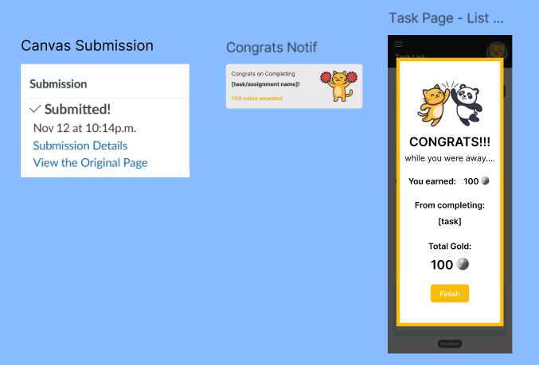

# Use Cases

## Jobs To Be Done (JTBD)

As part of our product use cases, we have the following 3 JTBDs:

### 1. Scheduling
As a student, I want to be able to organize all my to-dos in one place (including tests, assignments, and personal commitments) so that I can easily manage my schedule and stay on top of upcoming deadlines.

### 2. Notifications
As a student, I want to be reminded of my tasks and deadlines so that I can make sure I have them completed.

### 3. Gamification
As a student, I want to stay motivated on my school work so that I can continue keeping up with my tasks.

## Critical User Journeys (CUJs)

While our MVP is designed around 6 key CUJs, this semester’s development will focus on 3 that align with our core feature set — task completion gamification and task notifications.

The remaining CUJs will be included at a conceptual level to support storytelling and demonstrate the full product vision, but may not be fully implemented in this phase.

### 1. Task Notifications
**Description**: The user can receive notifications to keep on top of tasks and get mental health breaks. They will receive notifications to start taking breaks and also notifications to remind them to check on tasks.  

**JTBD**: Notifications & Keeping Track of Deadlines  

**User Path**:  
1. User creates a new task to workout during a certain time frame.  
2. User begins receiving notifications for breaks and other activities like exercising.
3. User also gets hourly notifications to remind them of tasks.

**UI/UX Mock-Up**:  

  

### 2. Manual User Task Completion & Rewards
**Description**: The user can mark tasks as complete directly in the extension. Upon completion, they are rewarded with animations and in-game currency.  

**JTBD**: Gamification  

**User Path**:  
1. User clicks **“Complete”** for a task in the extension  
2. User receives a reward animation.  
3. User sees in-game currency added to their balance.  

**UI/UX Mock-Up**:  

### 3. Rewards Redemption
**Description**: The user can spend their earned in-game currency to unlock prizes. Unlocked prizes are added to their collection.  

**JTBD**: Gamification  

**User Path**:  
1. User opens the **Rewards**.  
2. User checks their collected prizes.  
3. User navigates to the **Store**.  
4. User spends in-game currency to unlock a prize.  
5. User is redirected back to **Rewards**, where the new prize is added.  

**UI/UX Mock-Up**:  

  

## Additional CUJs

### 4. Onboarding Quiz
**Description**: The user will complete a short onboarding quiz about their work-study habits and goals. Their responses will help the AI create a more personalized and effective schedule for them.

**JTBD**: Scheduling

**User Path**:
1. The user opens the Chrome extension and signs up or logs in.
2. First-time users are automatically directed to the onboarding flow.
3. The user **uploads their timetable** for parsing and verification.
4. The user **selects their interests**.
5. The user **connects their Canvas account** to sync courses and deadlines.
6. The user **uploads course syllabi** to extract assignments and tasks.
7. The user enables or disables **notifications**.
8. The user learn what the product offers.
9. The user is redirected to the main dashboard.
10. All onboarding steps can be revisited later in the Settings page.

**UI/UX Mock-Up**:  

### 5. Schedule Generation
**Description**: The user uploads their time table and/or syllabi, and the AI extract todos and generated detailed task breakdowns. Users can export these as calendar files for easier integration into their workflow.  

**JTBD**: Scheduling

**User Path**:  
1. User uploads the timetable as a PDF file, and the system generates courses and tasks for each class session.
2. User reviews, confirms, and saves them in the extension.
3. User uploads syllabi as PDF files, and AI extracts all tests, exams, assignments, and micro-tasks for each assignment.
4. User reviews, confirms, and saves them in the extension.
5. User can export all tasks as .ics files and import them into an external calendar.

**UI/UX Mock-Up**:  

  

### 6. Schedule Adjustment
**Description**: The user may have changes to their schedule that are not included in their syllabi. They can manually add events, and the AI will update the calendar accordingly, including shifting deadlines if needed.  

**JTBD**: Scheduling

**User Path**:  
1. User opens the Chrome extension and clicks on the **“Add” (+)** button.  
2. A pop-up appears asking the user to choose between:  
   - Uploading a syllabus  
   - Adding a new "to-do"
3. User selects **Add To-Do** to better describe their situation.  
4. User is brought to a separate page to manually add a new event to their calendar.  
5. User submits the desired change.  
6. AI updates the schedule accordingly, shifting deadlines if necessary.  
7. User is returned to the updated calendar view.  
8. User can export the updated calendar as an `.ics` file.  

**UI/UX Mock-Up**:  

  

### 7. Canvas Task Completion & Rewards
**Description**: The user completes a task in Canvas. Upon completion, they are rewarded a notification from our application and in-game currency.  

**JTBD**: Gamification  

**User Path**:  
1. User submits an assignment on Canvas  
3. Our application automatically marks the assignment linked to the Canvas assignment complete and rewards the user with currency.
2. User receives a notification congradulating them upon completion. Shows new coin balance too.
3. User opens our extension and sees new coin balance. 

**UI/UX Mock-Up**:  

  

## Functional Requirements  
**Priority Features — Gamification & Notifications**
1. Users can earn in-game coins by completing tasks.
2. Users receive reminders as notifications for upcoming milestones and deadlines at defined intervals (e.g., 24 hours, 1 hour, 15 minutes before due time).
3. Users can use coins to purchase and open blind boxes. Each blind box contains a randomized collectible from a curated series of images, with a chance to unlock secret rewards such as animated GIFs.
4. Users can view their unlocked prizes on a dedicated page.
5. Allow user to sync with Canvas:
   - When a new task (assignment, quiz, etc.) is created in Canvas, it is automatically imported and added to the extension’s task list—users don’t have to enter it manually.
   - When a task is marked as completed in Canvas, its status is automatically updated as complete in the extension, ensuring users never need to update completion status twice.

**Deprioritized Feature — Scheduling**

1. The user can upload a syllabi, and the AI will automatically extract assignment deadlines and test dates from the document.
2. The user answers a series of questions tailored to their study habits and “hard no-s” (e.g., prefer to study between 6-9pm, club meeting from 7–10pm on Tuesdays, commute 9-10am daily).
3. The user can see their schedule (based on AI tailored output).
   - Calendar .ics file export
   - In-built task/breakdown calendar view of each task per course
   - Milestones (micro-deadlines)
4. The application allows users to adjust their schedule via settings, e.g., when an assignment due date changes.

## Non-Functional Requirements  

1. Performance:
   - Each page and extension popup loads in ≤3 seconds.
   - Notifications fire within ±2 minutes of scheduled time; break reminders within ±30 seconds.
   - Schedule generation (deprioritized): finishes within 30 seconds for a syllabus up to 10MB in PDF format.
2. Usability:
   - User onboarding requires no more than 3 steps.
   - All key features (task completion, notifications, rewards) accessible within 2 clicks from the dashboard.
   - Blind box purchase and opening process is intuitive and visually engaging.
3. Quality & Maintainability:
   - Automated tests cover all gamification and notification features.
   - Modular codebase, fully documented, with comprehensive error logging.
   - Schedule-related modules are isolated for possible future enhancement.
