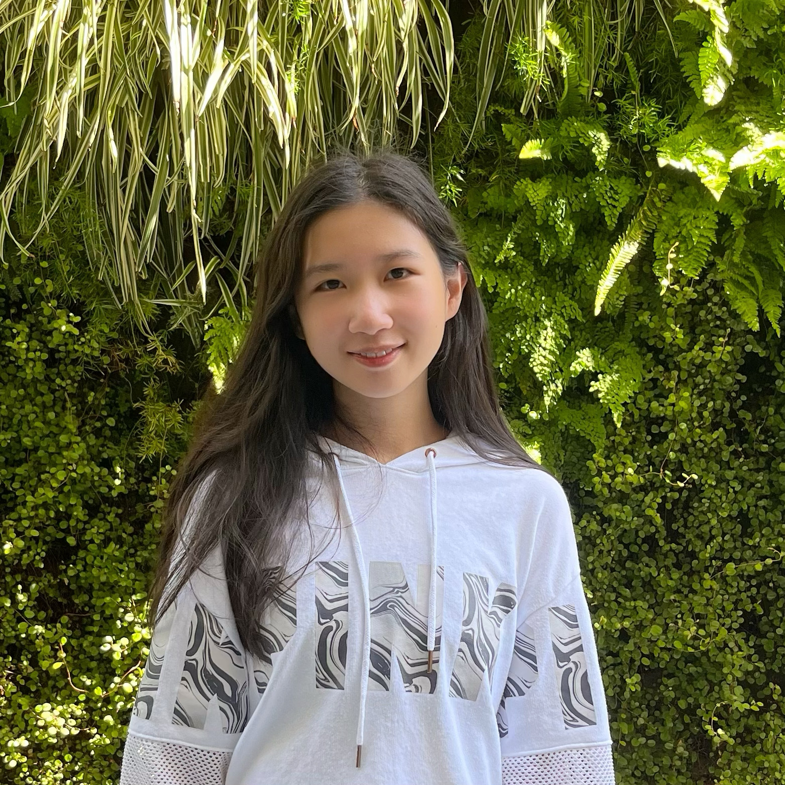

# Cynthia Zhou

- Student/Software Developer
- zhoucynthia8@gmail.com

## Links

- [GitHub](https://github.com/cyn900)
- [LinkedIn](https://www.linkedin.com/in/cynthiazhou123/)
- [Resume](https://docs.google.com/document/d/10f76RCOsBbxEBbGMo1JlRSYagFQKRUQW/edit?usp=sharing&ouid=116786383790878098052&rtpof=true&sd=true)

## About Me

Hi! I’m Cynthia, a 4th year student at the University of Toronto pursuing a double specialist in Computer Science and Data Science. I have experience in software development and data analysis, including an internship at Amazon and projects in iOS app development and web development. Outside of academics, I enjoy exploring different kinds of food and I’m a big fan of bubble tea.

## Strengths

- AI (prompt engineering)
- Data analysis and visualization
- Problem Solving

## Weaknesses

- Frontend development
- Organization (can sometimes spend too much time fine-tuning details)
